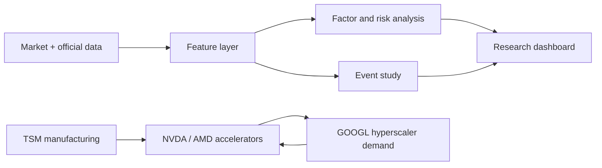

# How To Read The Four-Stock Quant Analysis

This project studies `AMD`, `TSM`, `NVDA`, and `GOOGL` as one AI compute value-chain cluster.

## What Each Output Means

`cumulative_returns.png`
: Growth of one dollar. This answers "who made the most money in this window?" It does not prove alpha.

`latest_relative_strength.png`
: Latest 60-day return and return versus QQQ. This is the first check for stock-specific strength.

`ytd_returns_vs_benchmarks.png`
: Current-year return versus QQQ, SOXX, and SMH. This is useful for weekly review.

`relative_price_ratios.png`
: Relative-price lens for NVDA/AMD, NVDA/TSM, AMD/TSM, GOOGL/QQQ, NVDA/SOXX, and TSM/SMH.

`risk_return_scatter.png`
: Latest 60-day return versus realized volatility. This checks whether recent return came with extreme risk.

`rolling_beta_qqq.png`
: Sensitivity to QQQ. Beta above 1 means the stock amplifies Nasdaq moves.

`correlation_heatmap.png`
: Whether these names diversify each other. High correlations mean cluster risk is concentrated.

`drawdowns.png`
: Peak-to-trough pain. Use this before deciding position sizing.

`tsmc_monthly_revenue.png`
: Manufacturing-side demand read-through. Use actual announcement dates for event studies.

`event_returns`
: Long-format event attribution table. For each event and affected ticker, compare raw return against QQQ, SOXX, SMH, and the pre-event `QQQ + SOXX + Δ10Y` factor model across windows such as `m1_p1`, `0_p1`, `0_p5`, and `0_p20`. If raw return is strong but factor abnormal return is weak, the move was mostly beta.

`event_reviews`
: Human-readable event recap generated from the event loop. Use it as the first draft of an event memo, then manually verify the interpretation and add missing fundamental context.

`segment_features`
: Company driver features built from curated and source-linked segment KPIs. Use them to connect price reactions back to Cloud, Data Center, margin, cash-flow, and TSM demand drivers.

`factor_residuals`
: Daily decomposition of actual return into expected return and residual return using PIT rolling exposures. Use `residual_return_20d` and `residual_return_60d` to check whether recent strength is company-specific after Nasdaq, semiconductor, and rate moves.

`evidence_cards`
: Source-linked evidence rows. Direction says whether the evidence supports or hurts the
current thesis; strength says how large the signal is; confidence says how reliable the
system thinks the evidence is. Do not treat one evidence card as a decision.

`research_stance`
: The per-ticker synthesis layer. It combines event, segment, cash-flow, and factor
evidence with ticker-specific weights and confidence caps. Stance is a research view,
not a trading command.

`reports/decision_memo.md`
: The weekly decision memo. Read the executive table first, then check each ticker's
positive evidence, negative/mixed evidence, risk flags, falsifiers, next catalysts, and
data-quality caveats.

`reports/stance_audit_report.md`
: The calibration report for the memo. It shows evidence counts, weighted score
contribution by type, confidence caps, conflict flags, and top evidence. Use this before
accepting a stance as reasonable.

## Practical Interpretation Order

1. Start with cumulative return to see the trend.
2. Check relative strength versus QQQ and SOXX.
3. Check beta and realized volatility to separate alpha from risk.
4. Check drawdown and correlation before thinking about position size.
5. Use TSMC revenue and curated events to ask whether the AI compute cycle is accelerating or slowing.
6. Read `event_returns` with `event_metrics` before writing an event memo, so the explanation ties price reaction to evidence rather than narrative alone.
7. Use `event_reviews.data_quality_flag` to separate completed event windows from incomplete ones, especially for very recent events.
8. Use `segment_features` to connect the market reaction back to company operating drivers.
9. Use `factor_residuals` to confirm whether the move survived QQQ/SOXX/rate attribution.
10. Use `evidence_cards` to audit what the system is using as proof.
11. Use `research_stance` and `reports/decision_memo.md` only after checking the caveats and falsifiers.
12. Use `reports/stance_audit_report.md` to verify that a stance is not dominated by one evidence type or hiding a material conflict.
