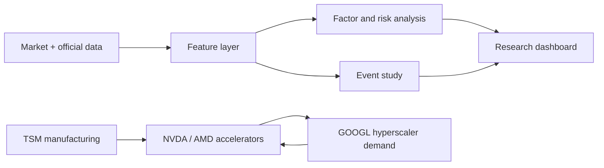

# How To Read The Four-Stock Quant Analysis

This project studies `AMD`, `TSM`, `NVDA`, and `GOOGL` as one AI compute value-chain cluster.

## What Each Output Means

`cumulative_returns.png`
: Growth of one dollar. This answers "who made the most money in this window?" It does not prove alpha.

`latest_relative_strength.png`
: Latest 60-day return and return versus QQQ. This is the first check for stock-specific strength.

`ytd_returns_vs_benchmarks.png`
: Current-year return versus QQQ, SOXX, and SMH. This is useful for weekly review.

`relative_price_ratios.png`
: Relative-price lens for NVDA/AMD, NVDA/TSM, AMD/TSM, GOOGL/QQQ, NVDA/SOXX, and TSM/SMH.

`risk_return_scatter.png`
: Latest 60-day return versus realized volatility. This checks whether recent return came with extreme risk.

`rolling_beta_qqq.png`
: Sensitivity to QQQ. Beta above 1 means the stock amplifies Nasdaq moves.

`correlation_heatmap.png`
: Whether these names diversify each other. High correlations mean cluster risk is concentrated.

`drawdowns.png`
: Peak-to-trough pain. Use this before deciding position sizing.

`tsmc_monthly_revenue.png`
: Manufacturing-side demand read-through. Use actual announcement dates for event studies.

## Practical Interpretation Order

1. Start with cumulative return to see the trend.
2. Check relative strength versus QQQ and SOXX.
3. Check beta and realized volatility to separate alpha from risk.
4. Check drawdown and correlation before thinking about position size.
5. Use TSMC revenue and curated events to ask whether the AI compute cycle is accelerating or slowing.
